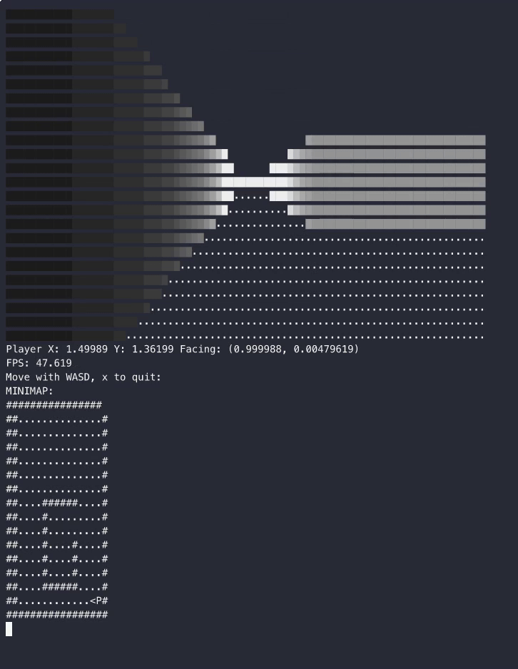

🕹️ Console FPS Raycasting Demo

A simple Wolfenstein 3D–style raycasting engine written in C++ that runs directly in the terminal.
Move around with WASD and explore a 3D world rendered entirely with ASCII characters.

🎥 Demo

🚀 Features

Basic raycasting engine (ASCII 3D view in terminal)

Real-time movement and rotation 

Wall shading based on distance and texture based on angle.

Expandable: monsters, doors, sprites, textures

⌨️ Controls

W – Move forward

S – Move backward

A – Turn left

D – Turn right

E - Rotate right

Q - Rotate left

X - exit

🎥 Full Demo

